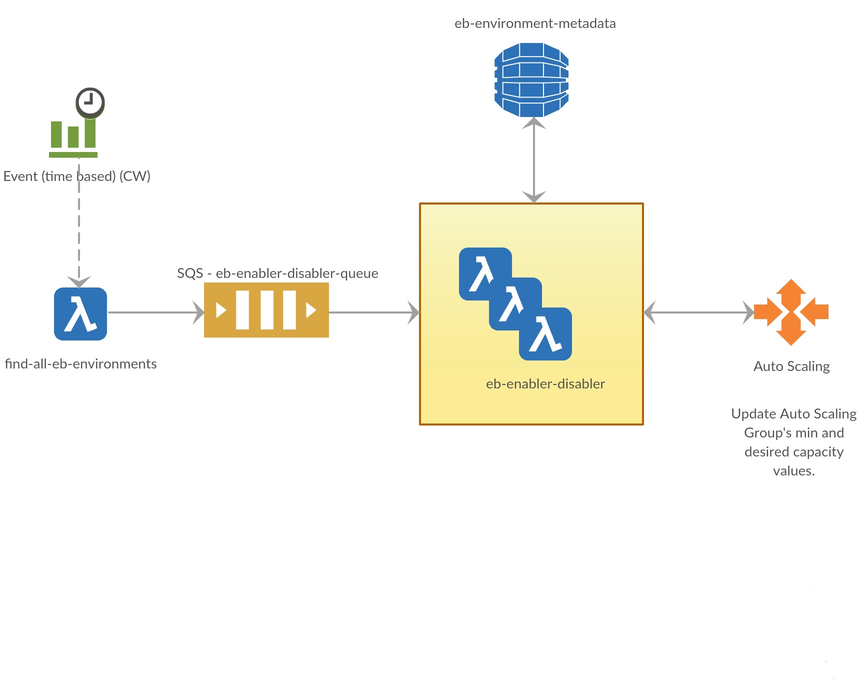

# ebs-inspector-lambda
  This is solution based on AWS lambda(s) that involves suspending and resuming AWS Elastic Beanstalk Environments according to off business hours configured. Normally outside of the business hours, test environments are often idle incurring unnecessary cost to the company. If they are shut down during when they are often non required could result huge saving to company.
  EBS Inspector lambda is written on `Java 8` and on one of the very popular Spring project (aka. module) `Spring Cloud Function`, which leverages AWS SDK for Java to  manage the AWS resources.

## How does it work?
  At the time of writing this article, AWS Lambda can run maximum of 15 minutes. In the large enterprise company where numerous services are involved, 15 minutes may not be sufficient, hence it is broken down into the multiple lambdas namely, `find-all-eb-environments` and `eb-enabler-disabler`.
  Lambda `find-all-eb-environments` fetches the list of all of the elastic beanstalk (EBS) environments from the AWS account in which lambda code is deployed, with the help of AWS SDK for Java, which internally uses the AWS REST API and finally publishes beanstalk environment detail as SQS message to be asynchronously consumed by `eb-enabler-disabler`.
  Next, `eb-enabler-disabler` makes a call to the list out the resources tied to EBS environment to find out Autoscaling group name, which subsequently used to get the details of tags attached to Autoscaling group. If Autoscaling group has tag `AutoSuspend` as `true` then it would be suspended if lambda is executed off the working hours. If the labmda is executed during the active working hours and the environment is in the suspended state then it would be put back in the service. Lambda wisely skips a few service calls depending upon when it is executed and what is the current status of EBS environment it is processing. To suspend the environment, lambda sets autoscaling groups's `min` and `desired` values as 0 so that EC2 instances managed by autoscaling group are terminated. Please note that when EBS environment is in suspeneded status, you will still pay for Elastic Load Balancer (ELB) associated with it but if you create an elastic beanstalk environment without ELB, you don't pay anything. Elastic beanstalk environment without ELB is great choice for DEV environment, while QA/Stage environment can act as mirror to production environment.
<p align="center">
  
</p>
  
### Lambda "find-all-eb-environments" configuration
  This lambda needs to know SQS information to put the elastic beanstalk environment details as a message so `eb-enabler-disabler` lambda can consume it for further processing. It is configured via environment variable `SQS_QUEUE_URL`. Lambda code is based on the Spring Cloud Function so it requires `FUNCTION_NAME` as environment variable so lambda knows which underlying function to invoke.

In summary, following environment variables are required.
<p align="center">
  
| Sr. No.  |      Environment Variable Name      |  Comments                                              |
|:--------:|:------------------------------------|:-------------------------------------------------------|
| 1        |    FUNCTION_NAME                    |  Set it as `FindAllEbEnvironmentsFunction`             |
| 2        |    SQS_QUEUE_URL                    |  SQS URL                                               |

</p>
  Lambda needs to know which elastic beanstalk environments can be suspended during off working hours because for whatever reason, it is possible that you would want to keep the few services running 24x7 in the test environments. Taking this requirement into account, lambda is designed to suspend the elastic beanstalk environments that are tagged with `AutoSuspend` as `true`. Yes, it can be changed to whatever key-pair tag you would like to filter against. See `Environment variables` for more details.

### Lambda "eb-enabler-disabler" configuration
  The very first thing that this function does, is to verify if current time is outside of the working hours and for that, lambda needs to know what are your off working hours. This can be defined using the environment variable named `OFF_BUSINESS_HOUR_WINDOW`. You can configure multiple off business hours windows seperate by comma (",").
  
  Say your company's working hours are 8AM-5PM, then you can configure `OFF_BUSINESS_HOUR_WINDOW` as "00:00-8:00,17:00-23:59". Start and End time windows are seperated by hypen ("-") and they are in format of HH:MM where HH can be from 00-23 and MM can be from 00-59.
   
  `OFF_BUSINESS_HOUR_WINDOW` is relative to timezone. If you had a bit of experience with the lambda, you would know that system default timezone where Lambda executes is GMT and configuring `OFF_BUSINESS_HOUR_WINDOW` isn't convenient option because GMT offset changes as per daylight saving hours. You are fortunate if you don't have to deal with daylight saving etc. but that's not the case with most of the usecases. Lambda is designed to accept timezone value that you want to use it for `OFF_BUSINESS_HOUR_WINDOW`. You can configure it through environment variable `OFF_BUSINESS_HOUR_TIMEZONE`, which you can set it with Timezone IDs. Please [refer](https://docs.oracle.com/javase/8/docs/api/java/time/ZoneId.html) for the list of valid Timezone IDs. 
  
  Say your off working hour time windows are valid in the Chicago timezone then set `OFF_BUSINESS_HOUR_TIMEZONE` as `America/Chicago`.
   
  This is good for Monday through Friday but wouldn't it be great if through some way, we can configure lambda to consider certain days such as Saturday and Sunday, as off days so the services will remain in the suspended status during these days. Yes, that's possible through environment variable `OFF_BUSINESS_DAY_OF_WEEK` and valid values are `MONDAY`,`TUESDAY`,`WEDNESDAY`,`THURSDAY`,`FRIDAY`,`SATURDAY`,`SUNDAY`. You can set multiple days seperated by comma (,).
   
  Say you want to consider Saturday and Sunday as off days then you can set environment variable `OFF_BUSINESS_DAY_OF_WEEK` with `SATURDAY,SUNDAY`. 

In summary, following environment variables are required.
<p align="center">
  
| Sr. No.  |      Environment Variable Name      |  Comments                                                                                                                            |
|:--------:|:------------------------------------|:-------------------------------------------------------------------------------------------------------------------------------------|
| 1        |    FUNCTION_NAME                    |  Set it as `EbEnablerDisablerFunction`                                                                                       |
| 2        |    OFF_BUSINESS_HOUR_WINDOW         |  Off business hour duration in HH:MM-HH:MM format, where HH (hours) can be 0-23 and MM (minutes) can be 0-59                         |
| 3        |    OFF_BUSINESS_HOUR_TIMEZONE       |  Timezone Id in reference to off business hour window                                                                                |
| 4        |    OFF_BUSINESS_DAY_OF_WEEK         |  Off business days. Valid values are `MONDAY`,`TUESDAY`,`WEDNESDAY`,`THURSDAY`,`FRIDAY`,`SATURDAY`,`SUNDAY`        |
| 6        |    EB_ENV_METADATA_TABLE_NM         |  Name of DynamoDB table that persists the auto scaling configuration of the environment                                              |
| 7        |    TAG_FILTER                       |  Filters the actionable environment based on Tag filter values configured.                                                           |

</p>

## Deployment
Easiest way to deploy entire resources stack is using [serverless.yml](serverless.yml). This is the configuration file required by [`serverless.com`](http://serverless.com) framework. If you are not familiar with this framework, you have been doing heavy-lifting all by yourself which isn't necessary.

Simply execute below command and it would deploy the stack of resources, so easy.

```
$serverless deploy --deploymentBucket <S3 bucket name to stage deployable artifacts>
```
If you want to create the resources using AWS Console then you need to know the below details and some you have to decode it from serverless.yml. Being adopter of best practices, I don't create AWS resources using AWS console.

### Platform
As stated earlier, this lambda is written on Java 8 so choose `java8` as runtime for the lambda function. You don't have run lambda in the one of your VPC. It wouldn't make difference whether you run it in the VPC or No VPC because all REST API calls are over internet. If you still chose to run it within VPC, ensure that selected subnet have enough IPs available because one of those IP addresses from private IP pool of subnet will be used by lambda.

### Lambda role permissions
IAM policy attached to lambda should typically look like as mentioned below.

	{
	    "Version": "2012-10-17",
	    "Statement": [
	        {
	            "Sid": "VisualEditor0",
	            "Effect": "Allow",
	            "Action": "autoscaling:UpdateAutoScalingGroup",
	            "Resource": "*"
	        },
	        {
	            "Sid": "VisualEditor1",
	            "Effect": "Allow",
	            "Action": [
	                "logs:CreateLogStream",
	                "dynamodb:PutItem",
	                "dynamodb:GetItem",
	                "sqs:SendMessage",
	                "dynamodb:UpdateItem"
	            ],
	            "Resource": [
	                "arn:aws:dynamodb:<AWS Region>:<AWS Account No>:table/eb-environment-metadata",
	                "arn:aws:sqs:<AWS Region>:<AWS Account No>:eb-enabler-disabler-queue",
	                "arn:aws:logs:<AWS Region>:<AWS Account No>:log-group:/aws/lambda/find-all-eb-environments:*",
	                "arn:aws:logs:<AWS Region>:<AWS Account No>:log-group:/aws/lambda/eb-enabler-disabler:*"
	            ]
	        },
	        {
	            "Sid": "VisualEditor2",
	            "Effect": "Allow",
	            "Action": [
	                "sqs:DeleteMessage",
	                "sqs:ReceiveMessage",
	                "sqs:GetQueueAttributes",
	                "logs:PutLogEvents"
	            ],
	            "Resource": [
	                "arn:aws:logs:<AWS Region>:<AWS Account No>:log-group:/aws/lambda/find-all-eb-environments:*:*",
	                "arn:aws:logs:<AWS Region>:<AWS Account No>:log-group:/aws/lambda/eb-enabler-disabler:*:*",
	                "arn:aws:sqs:<AWS Region>:<AWS Account No>:eb-enabler-disabler-queue"
	            ]
	        },
	        {
	            "Sid": "VisualEditor3",
	            "Effect": "Allow",
	            "Action": [
	                "elasticbeanstalk:DescribeEnvironmentResources",
	                "elasticbeanstalk:DescribeEnvironments",
	                "autoscaling:DescribeAutoScalingGroups",
	                "autoscaling:DescribeTags",
	                "cloudformation:DescribeStacks"
	            ],
	            "Resource": "*"
	        }
	    ]
	}

### Schedule lambda to execute
If you want to fully automate, you need to trigger lambda by some means during off working hours and during active working hours so that elastic beanstalk environments can be suspended or put them back in the service depending upon when lambda was execute and the working hours configured.